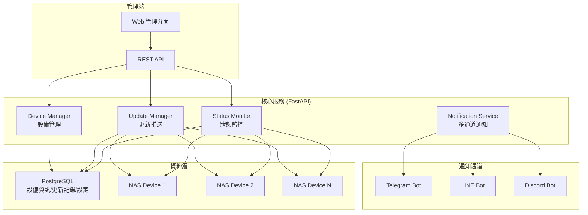

# Protech NAS Server Manager

[](https://opensource.org/licenses/MIT)
[](https://www.python.org/downloads/)
[](https://www.docker.com/)
[](https://fastapi.tiangolo.com/)
[]()

NAS 系統更新 Server — 管理多台 Protech NAS 設備的軟體版本、推送更新、監控狀態，並透過多通道通知管理員。

如果您覺得這個專案有幫助，歡迎給一顆 ⭐ Star！

## 功能特色

- **多設備管理**：支援 20+ 台 NAS 設備同時管理，每台獨立設定
- **軟體更新推送**：遠端推送更新到各 NAS（git pull → build → restart / rollback）
- **服務狀態監控**：即時監控各 NAS 服務狀態、資源使用
- **Web 管理介面**：Jinja2 + TailwindCSS 全端管理後台
- **多通道通知**：透過 Telegram、LINE、Discord 通知管理員更新狀態/異常
- **設定熱更新**：所有設定存於 PostgreSQL，修改即時生效無需重啟
- **版本管理**：記錄每台設備的版本歷史，支援一鍵 rollback

## 架構概覽



## 技術棧

| 類別 | 技術 |
|------|------|
| 後端框架 | Python 3.11+ / FastAPI |
| Web UI | Jinja2 + TailwindCSS + Alpine.js + HTMX |
| 資料庫 | PostgreSQL（設備資訊/更新記錄/設定） |
| Telegram | python-telegram-bot v20+ |
| LINE | line-bot-sdk-python v3 |
| Discord | discord.py |
| 遠端操作 | SSH (asyncssh) / Docker API |
| 部署 | Docker Compose |

## 快速開始

```bash
# 1. 複製環境變數設定
cp .env.example .env

# 2. 編輯 .env 填入各平台 API Key 和 NAS 連線資訊
vim .env

# 3. 啟動所有服務
docker compose up -d

# 4. 確認服務健康狀態
curl http://localhost:8060/health

# 5. 訪問管理介面
open http://localhost:8060/admin/
```

## 目錄結構

```
protech-nas-server-manager/
├── README.md                        # 專案說明
├── docker-compose.yml               # Docker Compose 配置
├── .env.example                     # 環境變數範例
├── pyproject.toml                   # Python 專案設定
├── docs/                            # 規劃文檔
│   ├── architecture.md              # 架構設計
│   ├── requirements.md              # 需求規格
│   ├── api-spec.md                  # API 規格
│   ├── deployment.md                # 部署指南
│   └── tasks/                       # 開發任務說明
├── app/                             # 應用程式原始碼
│   ├── main.py                      # FastAPI 入口
│   ├── config.py                    # 設定管理
│   ├── services/                    # 核心業務邏輯
│   ├── models/                      # 資料模型
│   ├── routers/                     # API 路由
│   ├── notifications/               # 多通道通知
│   ├── templates/                   # Jinja2 HTML 模板
│   ├── static/                      # CSS/JS 靜態檔案
│   └── utils/                       # 工具函式
├── tests/                           # 測試
└── scripts/                         # 工具腳本
```

## 文檔

- [架構設計](docs/architecture.md)
- [需求規格](docs/requirements.md)
- [API 規格](docs/api-spec.md)
- [部署指南](docs/deployment.md)
- [開發任務](docs/tasks/)

## 參與貢獻

歡迎提交 Pull Request 或回報 Issue！

1. Fork 本專案
2. 建立新分支 (`git checkout -b feature/amazing-feature`)
3. 提交更改 (`git commit -m 'Add amazing feature'`)
4. 推送到分支 (`git push origin feature/amazing-feature`)
5. 創建 Pull Request

## 行為準則

請閱讀 [CODE_OF_CONDUCT.md](CODE_OF_CONDUCT.md) 了解參與此專案應遵守的行為標準。

## 社群與討論

- 💬 加入 [Discord 伺服器](https://discord.gg/your-invite-code)（如有）
- 🐛 回報 Bug 或提出功能請求：[Issue Tracker](https://github.com/your-org/protech-nas-server-manager/issues)
- 📖 查看更新與公告

## License

本專案採用 MIT License — 詳情請參閱 [LICENSE](LICENSE) 檔案。

---

⭐ 如果這個專案對您有幫助，請給我一顆 Star！謝謝！
