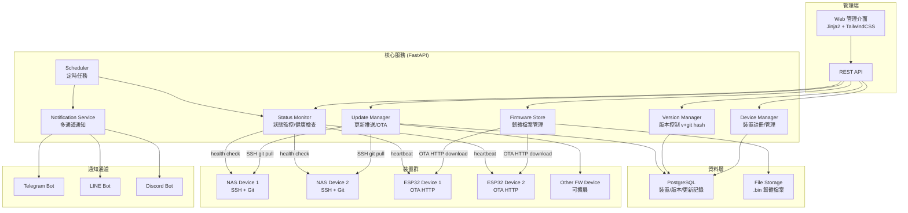
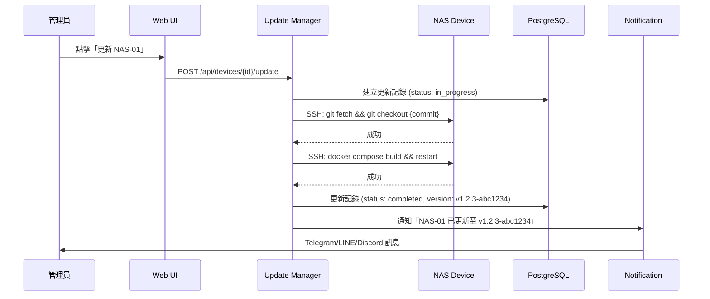
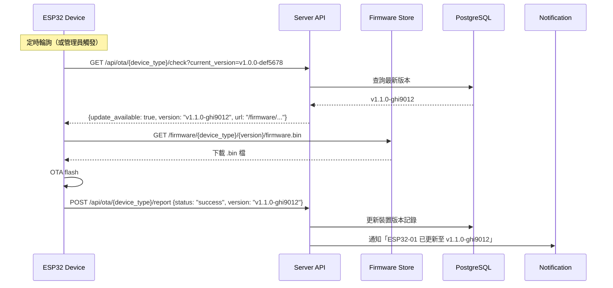

# 架構設計文檔

## 1. 系統概述

Protech NAS Server Manager 是一個多裝置系統更新平台，管理多台 NAS 設備與 ESP32（及其他 FW 裝置）的軟體/韌體版本、推送更新、監控狀態，並透過 Telegram、LINE、Discord 通知管理員。

## 2. 架構圖

### 2.1 系統全貌



### 2.2 更新流程（NAS - SSH/Git）



### 2.3 更新流程（ESP32 - OTA）



## 3. 多裝置類型架構

### 3.1 裝置類型抽象

系統使用 **Strategy Pattern** 支援不同裝置類型的更新方式：

```
DeviceUpdater (ABC)
├── NASUpdater          # SSH + git pull + docker rebuild
├── ESP32Updater        # OTA HTTP firmware download
├── GenericFWUpdater    # 通用 FW 更新（可擴展）
└── (未來新增...)
```

每種裝置類型定義：
- **更新方式**：SSH / OTA / HTTP Push / 其他
- **版本格式**：`v{major}.{minor}.{patch}-{git_hash_7}`
- **健康檢查方式**：SSH ping / HTTP heartbeat / MQTT
- **韌體來源**：git repo / 上傳 .bin / CI/CD artifact

### 3.2 資料模型

```
device_types
├── id (UUID)
├── name (e.g., "nas", "esp32", "router")
├── display_name (e.g., "Protech NAS", "ESP32 Sensor")
├── update_method (ssh_git / ota_http / custom)
├── health_check_method (ssh / http / heartbeat)
├── config (JSON - 類型特定設定)
├── created_at
└── updated_at

devices
├── id (UUID)
├── device_type_id (FK → device_types)
├── name (e.g., "NAS-Office-01")
├── description
├── is_active
├── current_version (e.g., "v1.2.3-abc1234")
├── current_git_hash (full 40-char hash)
├── ip_address
├── ssh_host / ssh_port / ssh_user (NAS)
├── last_seen_at
├── last_update_at
├── status (online / offline / updating / error)
├── config (JSON - 裝置特定設定)
├── created_at
└── updated_at

firmware_versions
├── id (UUID)
├── device_type_id (FK → device_types)
├── version (e.g., "v1.1.0")
├── git_hash (e.g., "ghi9012abcdef1234567890")
├── git_hash_short (e.g., "ghi9012")
├── version_display (e.g., "v1.1.0-ghi9012")
├── changelog
├── file_path (for .bin firmware)
├── file_size
├── file_checksum (SHA256)
├── git_repo_url (for git-based updates)
├── git_branch
├── is_latest
├── is_stable (stable / beta / dev)
├── released_at
├── created_at
└── updated_at

update_logs
├── id (UUID)
├── device_id (FK → devices)
├── from_version
├── to_version
├── to_git_hash
├── status (pending / in_progress / completed / failed / rolled_back)
├── triggered_by (admin / scheduler / device)
├── error_message
├── started_at
├── completed_at
└── created_at

notification_configs
├── id (UUID)
├── platform (telegram / line / discord)
├── is_active
├── config (JSON - token, chat_id, channel_id, etc.)
├── notify_on_update
├── notify_on_failure
├── notify_on_offline
├── created_at
└── updated_at
```

### 3.3 版本控制策略

- **版本格式**：`v{major}.{minor}.{patch}-{git_hash_7}`
  - 例如：`v1.2.3-abc1234`
- **git hash**：完整 40 字元存於資料庫，顯示時取前 7 字元
- **版本比較**：以 semantic version 為主，git hash 作為精確識別
- **Rollback**：回退到指定 version + git hash

## 4. Web 管理介面

### 4.1 技術方案

- **Server-side rendering**：FastAPI + Jinja2 模板
- **前端框架**：TailwindCSS + Alpine.js（輕量互動）
- **認證**：Session-based（Cookie），登入頁面
- **即時狀態**：HTMX 局部更新（定時 polling 裝置狀態）

### 4.2 頁面結構

```
/admin/login                        # 登入頁面
/admin/                             # Dashboard（全域狀態總覽）
/admin/devices/                     # 裝置列表（所有類型）
/admin/devices/{id}/                # 裝置詳情/操作
/admin/device-types/                # 裝置類型管理
/admin/firmware/                    # 韌體版本管理
/admin/firmware/upload              # 上傳韌體
/admin/updates/                     # 更新記錄/歷史
/admin/notifications/               # 通知設定
/admin/system/                      # 系統控制
```

## 5. 通知服務

### 5.1 通知時機

- 更新成功：`✅ NAS-01 已更新至 v1.2.3-abc1234`
- 更新失敗：`❌ ESP32-03 更新失敗：timeout`
- 裝置離線：`⚠️ NAS-02 已離線超過 5 分鐘`
- 新版本可用：`📦 ESP32 新韌體 v1.1.0-ghi9012 已上傳`

### 5.2 通知通道

| 平台 | 用途 |
|------|------|
| Telegram | 即時通知管理員（個人/群組） |
| LINE | 通知團隊（群組） |
| Discord | 通知開發頻道 |

## 6. 技術選型理由

| 元件 | 選擇 | 理由 |
|------|------|------|
| 框架 | FastAPI | 原生 async、自動 API 文件、適合即時操作 |
| Web UI | Jinja2 + TailwindCSS | 全棧 Python、輕量、無需額外 build |
| 資料庫 | PostgreSQL | JSON 欄位支援彈性設定、穩定可靠 |
| SSH | asyncssh | 原生 async、支援 key-based auth |
| 排程 | APScheduler | 定時健康檢查、定時通知 |
| Docker | docker-py | 管理本地/遠端 container |
| 通知 | 各平台 SDK | 成熟穩定 |
| 部署 | Docker Compose | 適合單機部署 |

## 7. 安全性考量

- **SSH Key 管理**：各 NAS 的 SSH key 存於 server，不經由 Web 傳輸
- **管理介面認證**：Session-based + bcrypt 密碼 hash
- **韌體完整性**：.bin 檔案附帶 SHA256 checksum，裝置下載後驗證
- **API 認證**：OTA check API 可設定 device token 驗證
- **環境變數**：所有密鑰透過 `.env` 管理

## 8. 擴展性設計

- **新增裝置類型**：實作 `DeviceUpdater` 子類 + 在 DB 註冊新 device_type
- **新增通知平台**：實作 `NotificationChannel` 子類
- **批次更新**：支援按裝置類型/標籤批次推送更新
- **CI/CD 整合**：webhook 接收 build 完成通知，自動建立新版本
